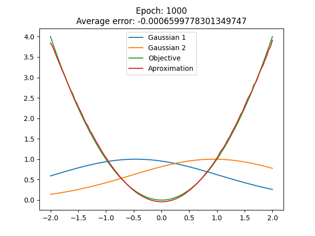

# Tarefa 1 - Aproximação de Funções com Modelos Fuzzy TSK

**Disciplina**: Inteligência Computacional

**Professor**: Rogério Martins Gomes

**Alunos**:
Marcelo Lopes de Macedo Ferreira Cândido
Milena Delarete Drummond Marques

## Objetivo

O objetivo desta atividade é, utilizando o Método do gradiente mostrados nos slides e vídeos do tópico 3, aproximar a saída para f(x)=x^2


## Execução do algoritmo

### 1. Configuração:
Na raiz do projeto, execute o seguinte comando para instalar as dependências necessárias:
```
pip3 install -r "./requirements.txt"
```

### 2. Funcionamento:
O comando `python3 fuzzy-tsk -h` mostra como usar o pacote, como visto na seguinte saída:
```bash
Perceptron usage:

python3 fuzzy-tsk -n <number-of-points> -m <maxepocas> -l <learning-rate>
```

## Exemplo

Para aproximar a saída com `<number-of-points>` = 120, `<maxepocas> ` = 1000 e `<learning-rate>` = 0.01, use o comando:
```bash
python3 fuzzy-tsk -n 120 -m 1000 -l 0.01
```

O gráfico impresso na tela será algo semelhante a:


**OBS.:** O resultado pode variar pois, ao executar o programa, os valores iniciais do parâmetros são gerados aleatoriamente. 


## Versões do Python recomendadas

Dois computadores foram usados para rodar esse algoritmo e as versão utlizadas foram `3.7.4` e `3.9.1`.

