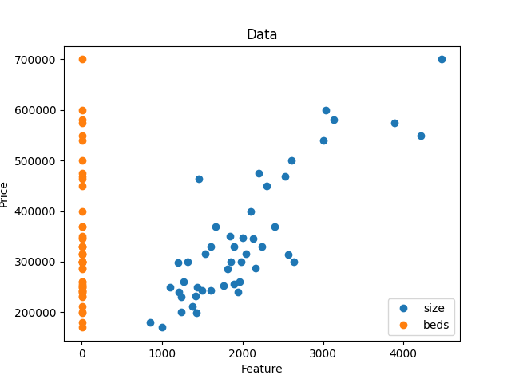
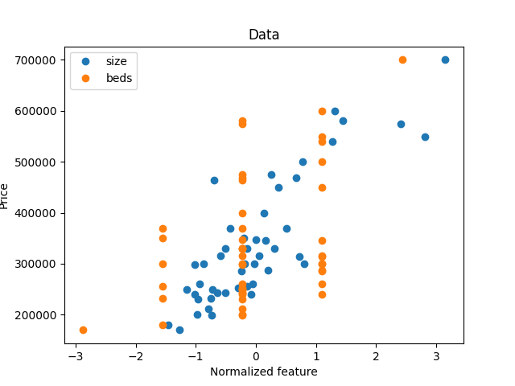
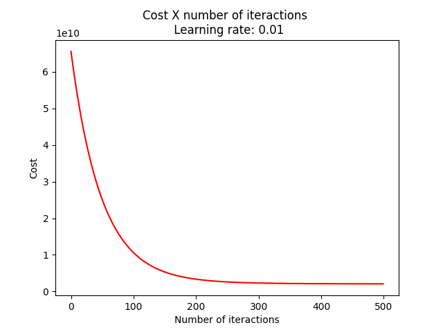
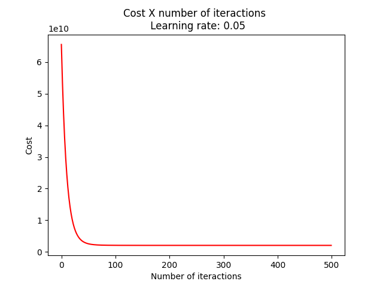
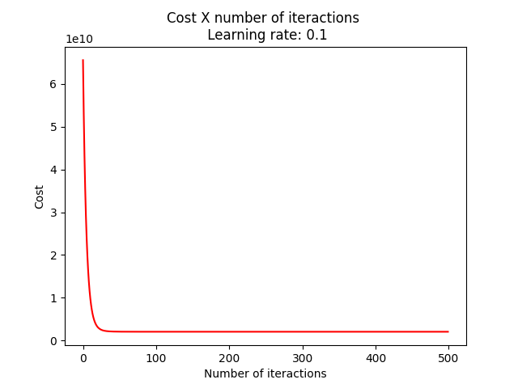

# Tarefa 3 - Regressão Linear

**Disciplina**: Inteligência Computacional

**Professor**: Rogério Martins Gomes

**Alunos**:
Marcelo Lopes de Macedo Ferreira Cândido
Milena Delarete Drummond Marques

## Objetivo

O objetivo desta atividade é implementar a regressão linear com múltiplas variáveis para prever o preço de uma casa.

## Execução do algoritmo

### 1. Configuração:
Na raiz do projeto, execute o seguinte comando para instalar as dependências necessárias:
```
pip3 install -r "./requirements.txt"
```

### 2. Funcionamento:
O comando `python3 linear-regression-multi-variables -h` mostra como usar o pacote, como visto na seguinte saída:
```bash
Perceptron usage:

python3 linear-regression-multi-variables -m <maxepocas> -l <learning-rate>
```

## Exemplo

Para aproximar a saída com `<maxepocas> ` = 100 e `<learning-rate>` = 0.01, use o comando:
```bash
python3 linear-regression-multi-variables -m 100 -l 0.01
```

## Gráficos

Os gráfico plotados durante a execução e de acordo com o pedido na atividade são:






## Versões do Python recomendadas

Dois computadores foram usados para rodar esse algoritmo e as versão utlizadas foram `3.7.4` e `3.9.1`.

