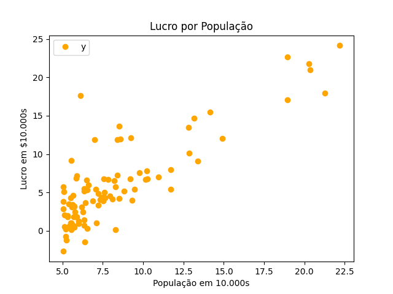
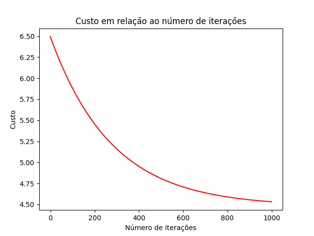
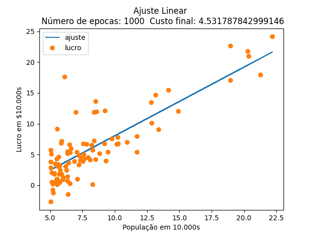

# Tarefa 3 - Regressão Linear

**Disciplina**: Inteligência Computacional

**Professor**: Rogério Martins Gomes

**Alunos**:
Marcelo Lopes de Macedo Ferreira Cândido
Milena Delarete Drummond Marques

## Configuração:
Na raiz do projeto, execute o seguinte comando para instalar as dependências necessárias:
```
pip3 install -r "./requirements.txt"
```

## 1. Com uma variável
### Funcionamento:
O comando `python3 linear-regression-one-variable -h` mostra como usar o pacote, como visto na seguinte saída:
```bash
linear-regression-one-variable usage:

python3 linear-regression-one-variable -m <maxepocas>
```

### Exemplo

Para aproximar a saída com `<maxepocas> ` = 100, use o comando:
```bash
python3 linear-regression-one-variable -m 100
```

### Principais resultados




## 2. Com múltiplas variáveis
### Funcionamento:
O comando `python3 linear-regression-multi-variables -h` mostra como usar o pacote, como visto na seguinte saída:
```bash
Perceptron usage:

python3 linear-regression-multi-variables -m <maxepocas> -l <learning-rate>
```

## Exemplo

Para aproximar a saída com `<maxepocas> ` = 100 e `<learning-rate>` = 0.01, use o comando:
```bash
python3 linear-regression-multi-variables -m 100 -l 0.01
```

## Gráficos
Os gráfico plotados durante a execução e de acordo com o pedido na atividade são:


### 2.3
Veja que agora não é possível traçar o ajuste linear como no exercício anterior. Por quê?

## 3. Equação Normal


