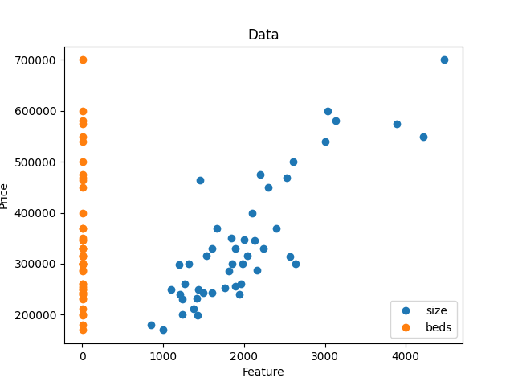
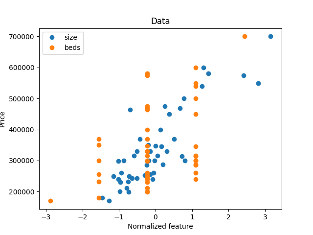
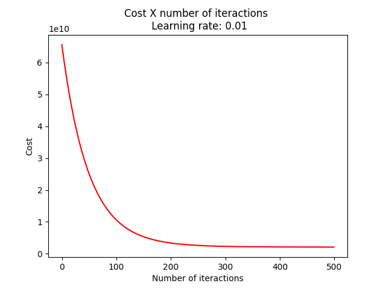
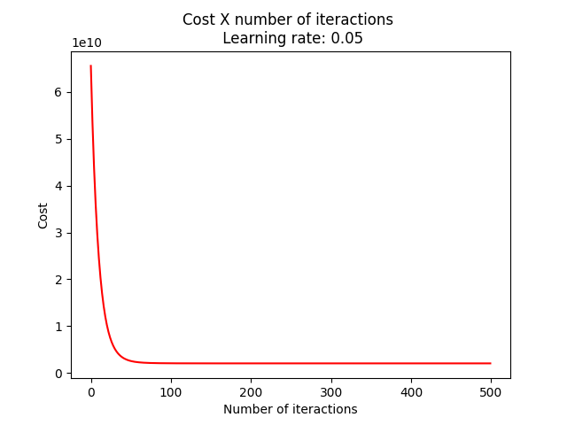
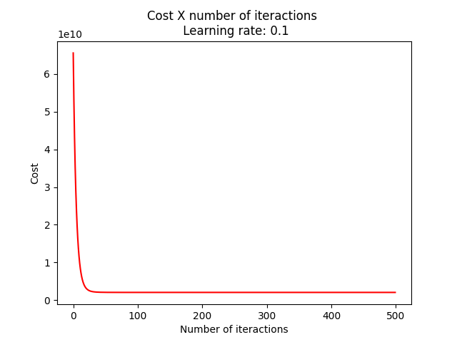

# Tarefa 3 - Regressão Linear

**Disciplina**: Inteligência Computacional

**Professor**: Rogério Martins Gomes

**Alunos**:
Marcelo Lopes de Macedo Ferreira Cândido
Milena Delarete Drummond Marques

## Configuração:
Na raiz do projeto, execute o seguinte comando para instalar as dependências necessárias:
```
pip3 install -r "./requirements.txt"
```

## Com uma variável
### Funcionamento:
O comando `python3 linear-regression-one-variable -h` mostra como usar o pacote, como visto na seguinte saída:
```bash
linear-regression-one-variable usage:

python3 linear-regression-one-variable -m <maxepocas>
```

### Principais resultados


## Com múltiplas variáveis
### Funcionamento:
O comando `python3 linear-regression-multi-variables -h` mostra como usar o pacote, como visto na seguinte saída:
```bash
linear-regression-multi-variables usage:

python3 linear-regression-multi-variables -m <maxepocas> -l <learning-rate>
```

### Principais resultados





### 2.3
Provavelmente pelo resultado ter mais de três dimensões, não sendo possível representar graficamente.

## Equação Normal
### Funcionamento:
Basta digitar o comando
```bash
python normal-equation
```

# Resultado
Equação nominal: 140.86 + 16978.19x

## Conclusão
Pode-se observar que implementar a equação nominal é mais simples que implmentar o gradiente decrescente, além de se ter um resultado exato.
